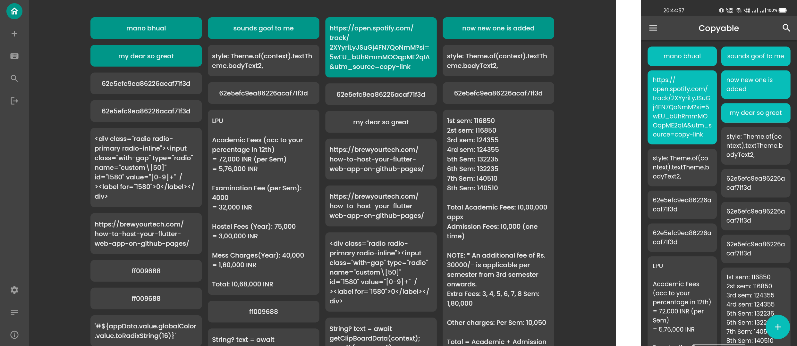

# Copyable 📋

An application that can be used to save some text and instantly get it when needed. This app is build for content creators, developers, designers and many more people who come across writing the same things again and again.

Some use cases are specified below:

- For a person posting on social media it's quite time taking to keep track of the tags #️⃣ he uses.
- Saving some links🔗 which can be fetched at a click.
- A company or freelancer handles multiple clients in a day, it's a time taking process to write to everyone, so it's better to save the intro text somewhere.
- Accessing some text across your devices (Mobile, Laptop, Tablet).
- This app also elimates the need for creating a **For Me🔮** group in your favourite messaging app.

   

> You can visit the live ✨ web application at https://amannegi.github.io/copyable
> 

## Screenshots 📱💻

 

